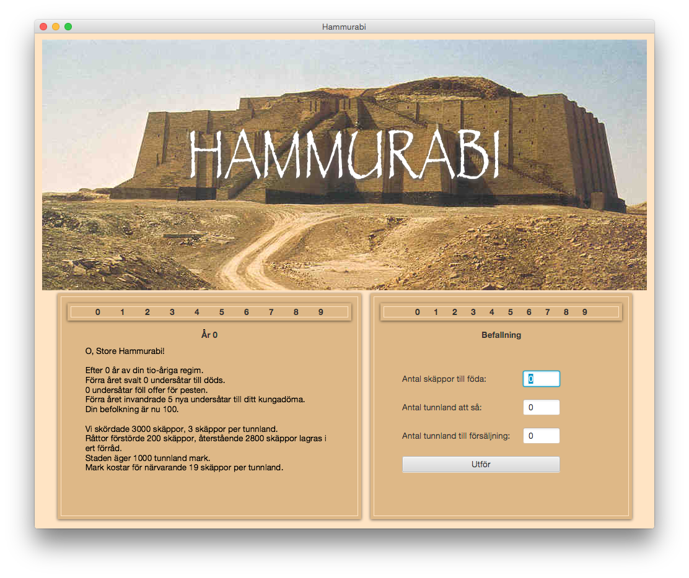

#Hammurabi

Hammurabi is a simple land and resource simulation game based on Doug Dyments 'The Sumer Game' from 1968.

The application is implemented in Java with GUI in JavaFX.

The player acts as an ancient Sumerian ruler trying to develop a stable economy by the wise management of his resources.

##Pre-requisites
* Java 8 (uses lambda expressions)
* Maven 3

##Licensing
Safestore is Open Source Software.
See _license.txt_